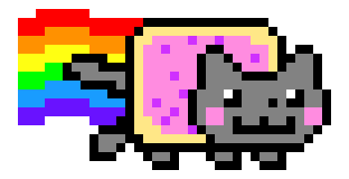

<p align="center">
  

  
  
  <a href="https://github.com/antuniooh/canvasGame/commits/master">
    
  </a>
  
   
</p>

<!-- PROJECT LOGO -->
<br />
<p align="center">
  <a href="https://github.com/antuniooh/canvasGame">
    
  </a>
</p>

<p align="center">
  
  
  
</p>


<!-- TABLE OF CONTENTS -->
<details open="open">
  <summary>Table of Contents</summary>
  <ol>
    <li>
      <a href="#-about-the-project">About The Project</a>
    </li>
    <li>
      <a href="#-documentation">Documentation</a>
    </li>
    <li>
      <a href="#-how-to-run">How To Run</a>
    </li>
  </ol>
</details>


<!-- ABOUT THE PROJECT -->
## 💻 About The Project
Nay's Adventure is a very simple and fun game. The aim is to accumulate as many jumps as possible without touching the ground. From the point where the ground is touched, the score resets and the user starts again.

To accumulate the highest number of points, the user will use the right mouse button to perform the jump or click on the screen. The game has no end, the user can have fun until he doesn't want to anymore. Its simple gameplay is also addictive.

Just Jump!


<!-- HOW TO RUN -->
## 🚀 How To Run

⚠️ For a better experience, open the project in the following link: https://antuniooh.github.io/canvasGame/ ⚠️

### Terminal
```bash

# Clone the repository
$ git clone https://github.com/antuniooh/canvasGame.git

# Access the project folder in your terminal / cmd
$ cd canvasGame

# Open HTMl
$ google-chrome index.html

```
